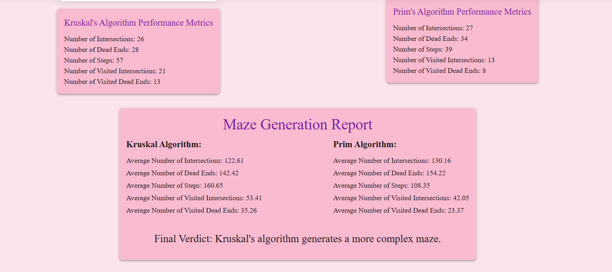

# 🌀 Maze Generator & Solver  

An interactive **Maze Generator** and **Solver** built using **MongoDB, Express, React, and Node.js (MERN stack)**.  
This project allows users to generate and solve mazes using different algorithms, customize maze sizes, visualize step-by-step execution, and analyze performance metrics.  

---

## 🚀 Features  

### ✅ **Maze Generation**  
- Implements **Kruskal’s and Prim’s algorithms** for maze generation.  
- **Interactive visualization** using **D3.js**, where users can see how the maze is being solved .Also how maze is being built stepwise.
- **Customizable maze size** for different levels of complexity.  

### ✅ **Maze Solving**  
- Uses **Heuristic-based Depth First Search (HDFS)** for efficient pathfinding.  
- **Visualizes the solving process stepwise**, showing the decision-making of HDFS.  
- **Performance analysis** to determine maze complexity.  

### ✅ **User Interaction & UI**  
- **Built with Material UI (MUI)** for a modern, interactive experience.  
- Users can **adjust maze size** before generation.  
- **Stepwise execution mode** to observe how mazes are generated and solved in real time.  

### ✅ **Performance Metrics & Reports**  
- Compares maze complexity based on different algorithms.  
- Tracks **Number of Intersections,Number of Dead Ends,Number of Steps,Number of visited Intersections,Number of visited Dead Ends**.  
- Generates **reports on maze complexity**.  

---

## 🛠️ Tech Stack  

- **React.js** - Frontend UI (MUI components)  
- **Node.js & Express.js** - Backend API  
- **MongoDB** - Database for storing maze configurations & metrics  
- **D3.js** - Maze visualization  
- **Material UI (MUI)** - UI Components  

---

## 🏗️ Installation & Setup  

### 1️⃣ Clone the Repository  
```bash
git clone https://github.com/Praju2002/Minorproj.git
cd Minorproj
```

### 2️⃣ Setup the Server  
```bash
cd server
npm install
```

### 3️⃣ Setup the Database  
Create a `.env` file in `server/` with:
```env
MONGODB_URI=mongodb://localhost:27017/mazeDB
```

### 4️⃣ Run the Server  
```bash
nodemon server.js
```

### 5️⃣ Setup the Client  
```bash
cd ../client
npm install
npm run dev
```

## 📊 Maze Algorithms  

### 1️⃣ **Kruskal’s Algorithm**  
- Uses **Minimum Spanning Tree (MST)**.  
- Produces **more open pathways**.  

### 2️⃣ **Prim’s Algorithm**  
- Expands from a **random point**.  
- Creates **more intricate mazes**.  

### ✅ **Maze Solving: HDFS**  
- Modified **DFS with heuristics**.  
- **Backtracks efficiently**.  
- Works well for **complex mazes**.  

---

## 🖥️ Interactive Visualization  

- **Step-by-step maze generation & solving animations**.  
- **Performance analysis dashboard** with metrics.  


## 📜 Future Enhancements  

- ✅ Implement **A\* Search & Dijkstra’s Algorithm**.  
- ✅ Add **leaderboards for fastest solvers**.  

---

## 📧 Contact  
For questions, reach out at: **prajukhanal21@gmail.com**  

---


**📸**  
  
  
  

